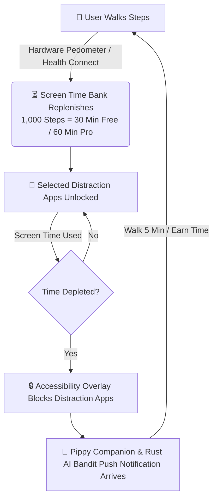
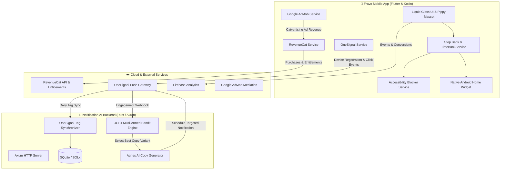

# 🐾 Fravo — Walk to Earn Screen Time

<p align="center">
  
</p>

<p align="center">
  <strong>The gamified digital wellness app where physical movement unlocks your digital life.</strong><br>
  Built with Flutter, RevenueCat, OneSignal, Google Mobile Ads (Catvertising), and a high-performance Rust AI Notification Backend.
</p>

<p align="center">
  <a href="https://shipaton.com"></a>
  <a href="https://flutter.dev"></a>
  <a href="https://onesignal.com"></a>
  <a href="https://www.rust-lang.org"></a>
  
  
</p>

---

## 🏆 RevenueCat Shipaton 2026 Submission

Fravo was built and launched specifically for the global **RevenueCat Shipaton 2026** hackathon (Aug 1 – Sep 30, 2026).

### Targeted Prize Tracks & Competitive Advantages

| Category | Why Fravo Stands Out |
| :--- | :--- |
| **🥇 OneSignal "Keep Them Coming Back" Award ($25,000)** | **Autonomous AI Push Engine**: Rust backend synchronizes 290+ player tags daily and uses a **Multi-Armed Bandit (UCB1)** reinforcement learning algorithm to optimize notification conversion rates based on live open/click/dismissal webhooks. |
| **🥇 Next Gen Award ($20,000)** | Built by a student creator solving modern student doomscrolling and sedentary study habits. Features Pippy the evolving mascot and seamless viral referral passes. |
| **🥇 Catvertising Award ($20,000)** | **Direct Ad Revenue Tracking**: Google AdMob Rewarded Ads automatically record impression-level revenue directly into RevenueCat via `Purchases.adTracker.trackAdRevenue` on every `onPaidEvent`. |
| **🥇 HAMM Award (Help Apps Make Money) ($50,000)** | Thoughtful dual-tier economy (Free: 3 apps, 30 min/1k steps vs Pro: unlimited apps, 60 min/1k steps, zero ads) with viral 7-day referral trial loops powered by RevenueCat. |
| **🥇 RevenueCat Design Award ($20,000)** | Premium liquid glassmorphism, Pippy emotional companion animations, interactive soundscapes, and native Android Home Screen AppWidget. |
| **🥇 RevenueCat Peace Prize ($20,000)** | Genuine social good: combats screen addiction, improves focus, and encourages daily cardiovascular fitness through a positive reward habit loop. |
| **🏆 Grand Prize: Build & Grow** | Full end-to-end production mobile app with subscription monetization, analytics, crash reporting, and live stores integration. |

---

## 🔑 Judge Testing Credentials (Free 7-Day Pro Access)

We have built a zero-friction referral redemption system so hackathon judges can experience all **Fravo Pro** features without spending real money:

1. **Install & Open Fravo** on any Android device or emulator.
2. Complete the quick onboarding flow.
3. On the Home Dashboard, scroll down to the **"Invite Friends / Redeem Code"** card.
4. Enter code: `FRAVO-PROMO` (or your personal referral code) and tap **Claim 7 Days Pro**.
5. Your account immediately unlocks **Fravo Pro (7-Day Trial)** with:
   - ⚡ **2x Reward Rate** (1,000 steps = 60 minutes)
   - 🛡️ **Unlimited App Blocking**
   - 🚫 **Zero Ad Interruptions**
   - 📊 **Advanced Screen Time Analytics**

---

## 💡 The Core Problem & The Fravo Habit Loop

Students and professionals lose **4 to 6 hours every day** to mindless doomscrolling on Instagram, TikTok, and YouTube. Traditional app limiters fail because they rely on willpower and negative friction, leading users to disable them within days.

Fravo inverts this dynamic by introducing a dopamine-aligned reward mechanism: **Movement unlocks your digital life.**



---

## ✨ Key Features

### 1. 🚶 Step Banking Engine
- Dual-mode tracking: Hardware step pedometer for instant real-time feedback + Google Health Connect for background verification.
- Configurable step-to-time conversion rate (5–60 minutes per 1,000 steps).
- Midnight rollover with automated daily usage archiving.

### 2. 🛡️ Native Accessibility App Blocker
- Custom native Kotlin `AppBlockerAccessibilityService` + `zo_app_blocker`.
- Monitors selected distraction apps (Instagram, TikTok, YouTube, Reddit, or custom packages).
- Non-punitive, sleek blocking screen featuring Pippy and remaining required steps.

### 3. 🐾 Pippy the Digital Companion
- An animated, reactive digital pet that visually reflects your walking progress.
- 4 customizable companion personalities:
  - 🥊 **Tough Love**: Direct, no-nonsense push notifications.
  - 🌟 **Friendly Motivator**: Warm, encouraging milestones.
  - 🧘 **Stoic Guide**: Philosophical, mindfulness-focused reminders.
  - 🦥 **Chill Sloth**: Relaxed, low-pressure nudge.

### 4. 💳 RevenueCat Subscriptions & Monetization
- Fully native paywall with Monthly, Annual, and Lifetime subscription packages via `purchases_flutter: 10.12.0`.
- Real-time entitlement validation (`premium`), offline fallback caching via Hive, and instant restoration.
- Viral 7-day referral trial loops to bootstrap viral user acquisition.

### 5. 🎯 Catvertising (RevenueCat Ad Revenue Tracking)
- Integrates Google Mobile Ads (AdMob) Rewarded Ads for free users to earn emergency passes.
- Ad impression revenue is captured via AdMob `onPaidEvent` and instantly forwarded to RevenueCat:
  ```dart
  Purchases.adTracker.trackAdRevenue(
    AdRevenueData(
      mediatorName: AdMediatorName('admob'),
      adFormat: AdFormat.rewarded,
      adUnitId: paidAd.adUnitId,
      revenueMicros: valueMicros.round(),
      currency: currencyCode,
      precision: _mapPrecision(precision),
    ),
  );
  ```

### 6. 🧠 OneSignal + Rust AI Notification Engine (Multi-Armed Bandit)
- Pulls daily user tags from OneSignal (290+ test players, distraction preferences, companion personalities, streak states).
- **Agnes AI** dynamically generates context-aware notification copy.
- **Upper Confidence Bound (UCB1)** reinforcement learning algorithm continuously tests copy variants and scores engagement (opens, clicks, conversions, dismissals).
- Rich action buttons (`[Walk 5 Min]`, `[Bank Time]`, `[Snooze]`) and custom deep-links (`fravo://screen_time`, `fravo://paywall`).

### 7. 📲 Native Android Home Screen AppWidget
- Custom Kotlin `AppWidgetProvider` showing live banked minutes, step progress, and streak pills directly on your phone launcher.

---

## 🏗️ System Architecture



---

## 📂 Repository Structure

```
fravo/
├── android/                 # Native Android app, AccessibilityService, Kotlin AppWidget
├── assets/                  # High-res app icons, companion graphics, sounds
├── lib/
│   ├── main.dart            # App entrypoint, lifecycle observer, theme
│   ├── screens/             # Dashboard, Paywall, Companion Pet, Settings, Stats, Onboarding
│   ├── services/
│   │   ├── admob_service.dart       # AdMob Rewarded Ads + Catvertising RevenueCat tracking
│   │   ├── app_services.dart        # Unified service orchestrator
│   │   ├── blocker_service.dart     # Accessibility overlay & time limit manager
│   │   ├── companion_service.dart   # Pippy pet mood & personality engine
│   │   ├── health_service.dart      # Pedometer & Health Connect step listener
│   │   ├── onesignal_service.dart   # OneSignal SDK, deep links, tag sync
│   │   ├── revenuecat_service.dart  # Subscriptions, paywall, 7-day referral trial
│   │   ├── time_bank.dart           # Step-to-minute banking math & persistence
│   │   └── widget_service.dart      # Android home screen widget synchronization
│   └── widgets/             # Reusable liquid glass UI components, Pippy avatar, sheets
├── notification-ai-backend/ # Rust Axum backend with UCB1 Multi-Armed Bandit engine
├── packages/
│   └── zo_app_blocker/      # Custom local Flutter plugin for native app blocking
└── test/                    # 19 comprehensive unit & widget tests (100% passing)
```

---

## 🛠️ Getting Started & Local Development

### Prerequisites
- [Flutter SDK](https://flutter.dev) (v3.10.7+ recommended)
- Android Studio with Android SDK 34+
- Java JDK 17
- (Optional for Backend): [Rust & Cargo](https://rustup.rs)

### Installation

1. **Clone the repository:**
   ```bash
   git clone https://github.com/anish-345/fravo.git
   cd fravo
   ```

2. **Install Flutter dependencies:**
   ```bash
   flutter pub get
   ```

3. **Run Code Analysis & Linter:**
   ```bash
   flutter analyze
   # 0 issues found!
   ```

4. **Run Automated Test Suite:**
   ```bash
   flutter test
   # 19/19 tests passed!
   ```

5. **Launch on Android Emulator or Physical Device:**
   ```bash
   flutter run
   ```

---

## 🔗 Important Links

- 📱 **Google Play Store:** [Fravo on Google Play](https://play.google.com/store/apps/details?id=avionti.fravo)
- 🌐 **Hackathon Portal:** [RevenueCat Shipaton 2026](https://shipaton.com)
- 🦀 **Rust AI Backend Repo:** [anish-345/fravoau](https://github.com/anish-345/fravoau)
- 📄 **Submission Details:** [DEVPOST_SUBMISSION.md](DEVPOST_SUBMISSION.md)
- 🎬 **Video Walkthrough Script:** [DEMO_VIDEO_SCRIPT.md](DEMO_VIDEO_SCRIPT.md)

---

## 📄 License

This project is open-source and available under the [MIT License](LICENSE).
